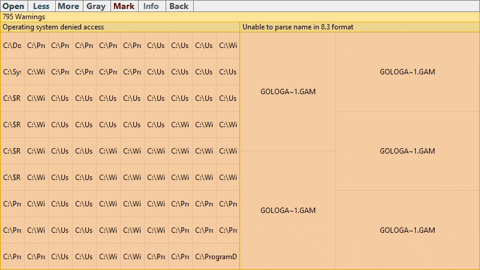

# Error reports

When something went wrong the **Error** button becomes visible. Click on it to display the error tab

## Errot tab

The error tab displays error reports of three severity types: **error**, **warning** and **info**

Click the **Color** button to colorize reports according to its severity 

## Warning severity

**Warnings** is most common type of reports. Its mean something happened that brings the internal file system structure in partically incorrect state. But mostly displayed file system structure is correct

## Info severity

**Info** report means that application unable to perform some operation, but this has no effect on the internal file system structure. For example operating system reported that deleted file's name is changed

## Error severity

When the application is unable to continue watching file system changes to keep the internal file system structure in correct state, the **error** report occurs

For example, you are exploring a remote file system and the Internet connection is interrupted

## Copy report text

**Double click** on a report item to copy its text to clipboard. Typically this is a file system path that could not be processed

## Remove reports

**Right click** on a report item to remove it. Right click on a group of reports to remove the group. Right click on the root node to clear the error tab

## See also
- [Navigation](Navigation.md)
- [Mark mode](MarkMode.md)
- [Overview](../README.md)