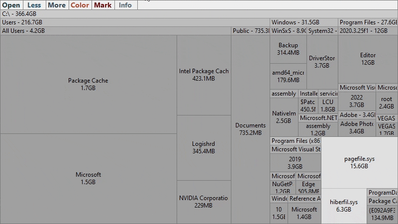
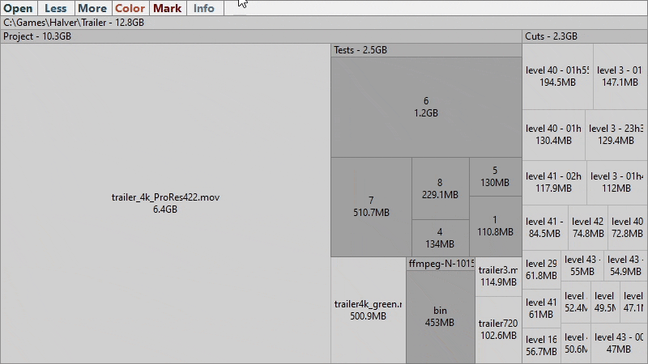
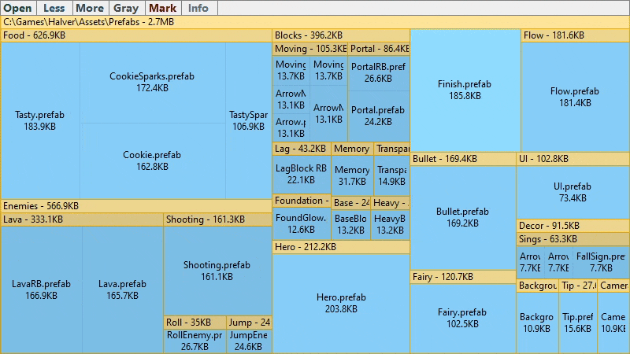
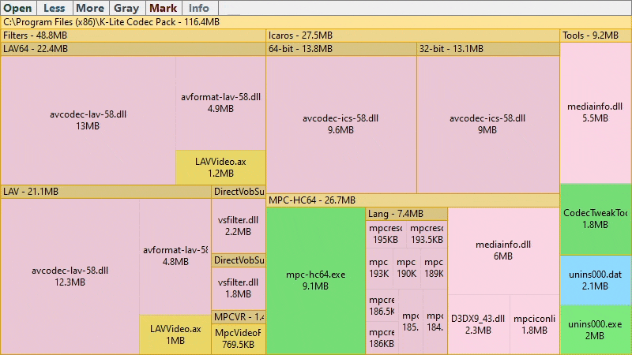

# Mark mode

While exploring a file system, you may decide that some **big files** you will not remove anyway. In this case you can **hide** them to free space for other nodes

## Hide nodes

**Richt click** on file to hide it from displaying. Right click on folder to hide it and all its content

Hidden node is **marked** now

## Mark tab

Click on the **Mark** button to enable **mark mode**. In the mark mode all nodes are displaying — both marked and unmarked

## Mark mode

In the mark mode unmarked nodes are **hatched** to separate them from marked

Click on the the **Color** button to colorize marked nodes according to them root nodes

## Unmark nodes

In the mark mode right click on a marked node to **unmark** it 

Click on the **Seek** button to return back to the defaut **seek mode** for exploring the file system further

## Nested marking

Suppose you hid the node. And then you hid its **containing folder**. In this case if you want to show the node again then you should to right click on this node in the mark mode. Then the marked node and its containing folder both will be unmarked 

If you want to show only the containing folder then right click in the mark mode on this folder or on any of its child nodes except the marked node

## See also
- [Error reports](ErrorReports.md)
- [Navigation](Navigation.md)
- [Overview](../README.md)
