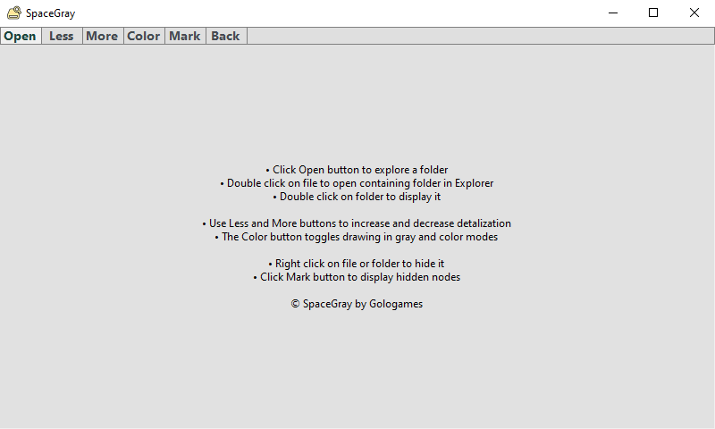
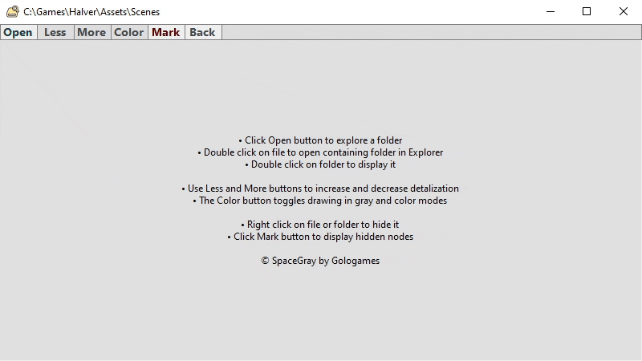
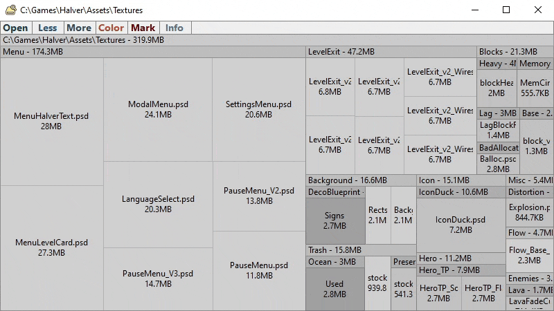
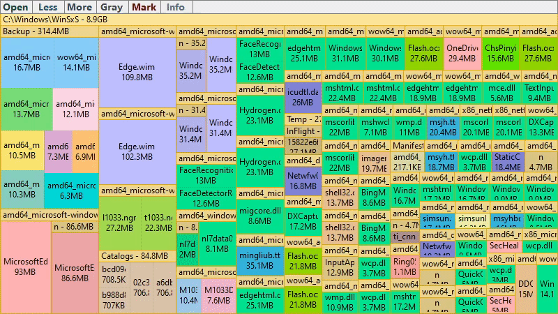
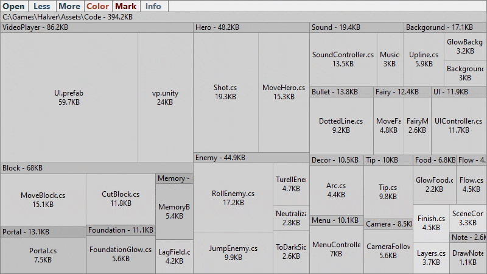
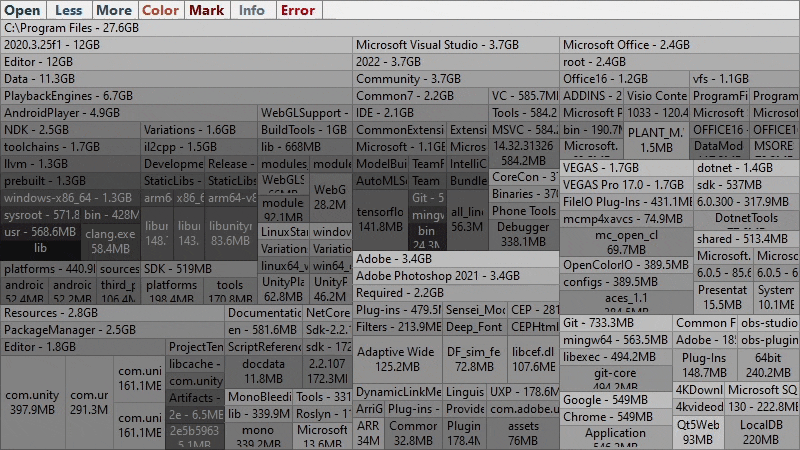

# Navigation

At the start of the application you will see the **Info tab** with a quick guide

## Explore file system

Click the **Open** button to show folder browser dialog to select a folder for displaying

Any time you can click the Open button again and select another folder for exploring

## Open folder containing file

**Double click** on file to open its containing folder in Windows Exlorer

This way you can remove unnecessary files and folders

## Check the full name

The [squarified treemap](https://en.wikipedia.org/wiki/Treemapping) layout algorithm used by the application produces a good aspect ratio for drawn rectangles (close to 1:1). But some long file names may be cutted and difficult to read

**Hover** mouse over the file or folder to see its full name in the header **bar** at the top right of the application

## Display folder

**Double click** on folder to display it as root to see more its content

Double click on root folder to set its parent folder as root

## Return back

Suppose you displayed deeply nested folder. Then you can to **double click** on the header bar to display previous root folder

## See also
- [Mark mode](MarkMode.md)
- [Error reports](ErrorReports.md)
- [Overview](../README.md)