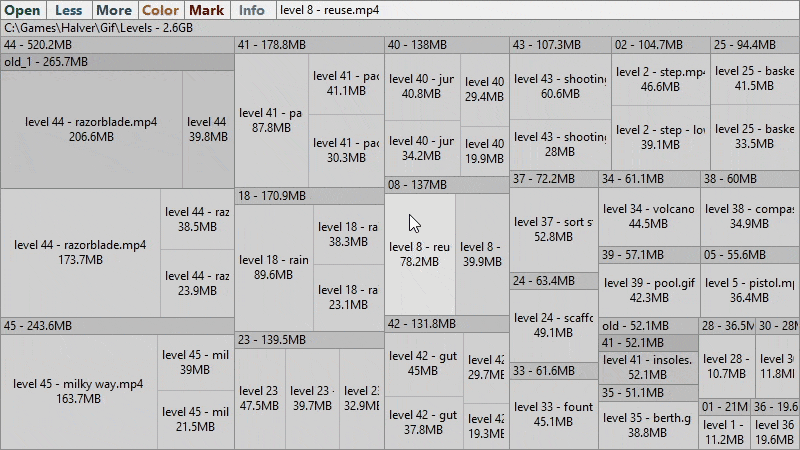

# SpaceGray
SpaceGray is a simple tool that will help you to **explore size of files and folders** in your file system

Files and folders are displayed in a [treemap layout](https://en.wikipedia.org/wiki/Treemapping). You can **double click** on file to open containing folder in Windows Explorer. Double click on folder to display it as root

## Download

Windows executable file: [x64](https://drive.google.com/file/d/1DFh4YEKFMtG-n5ntRR_HdCvGeRPDEAbm/view) | [x84](https://drive.google.com/file/d/18aYsesKeHUKIn5K-EXN5Uf-A296yb7kK/view)

You should install [.NET 6 Desktop Runtime](https://dotnet.microsoft.com/en-us/download/dotnet/6.0) to run this application

## Features

- Click the **Color** button to colorize files by its extensions

#
- Use the **Less** and **More** buttons to increase and decrease detalization

#
- You can **resize** the app to fit any aspect ratio to work effectively with Windows Explorer. **File system changes** will be immediately displayed

## See also
- [Navigation](Docs/Navigation.md)
- [Mark mode](Docs/MarkMode.md)
- [Error reports](Docs/ErrorReports.md)